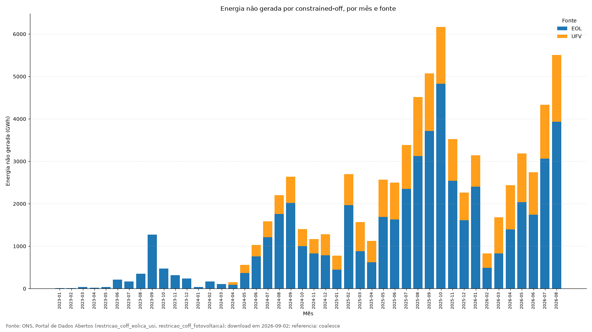
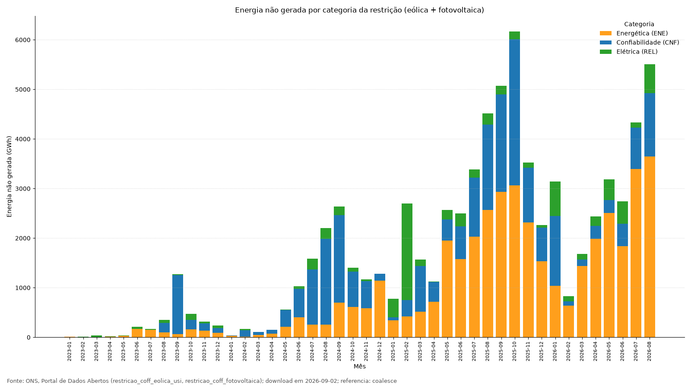
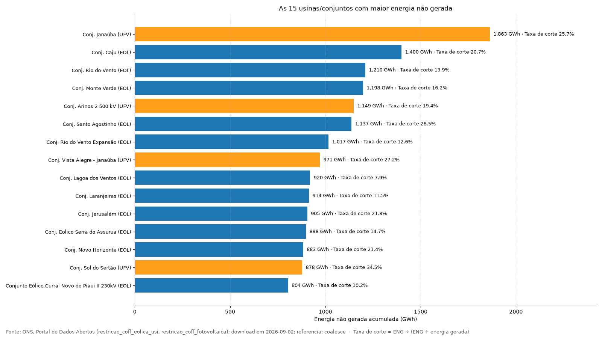
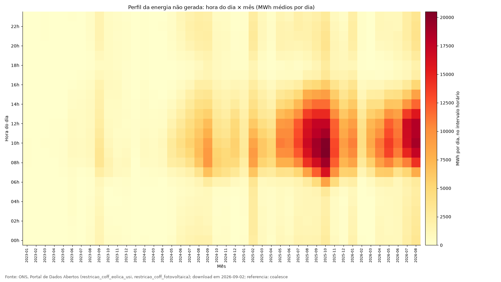
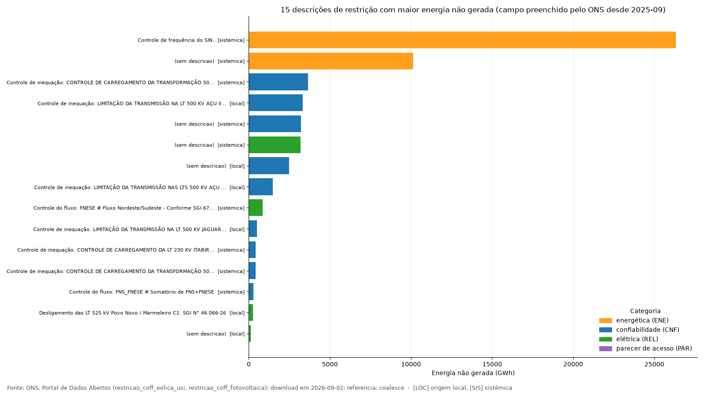
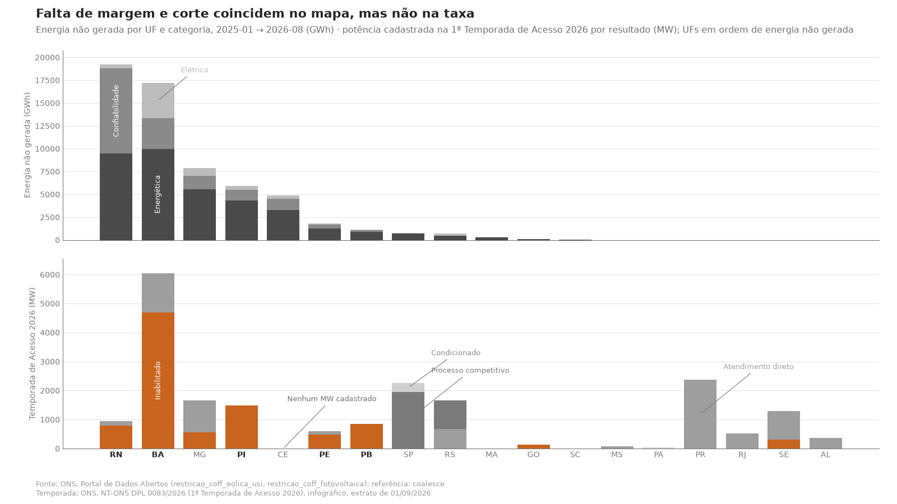
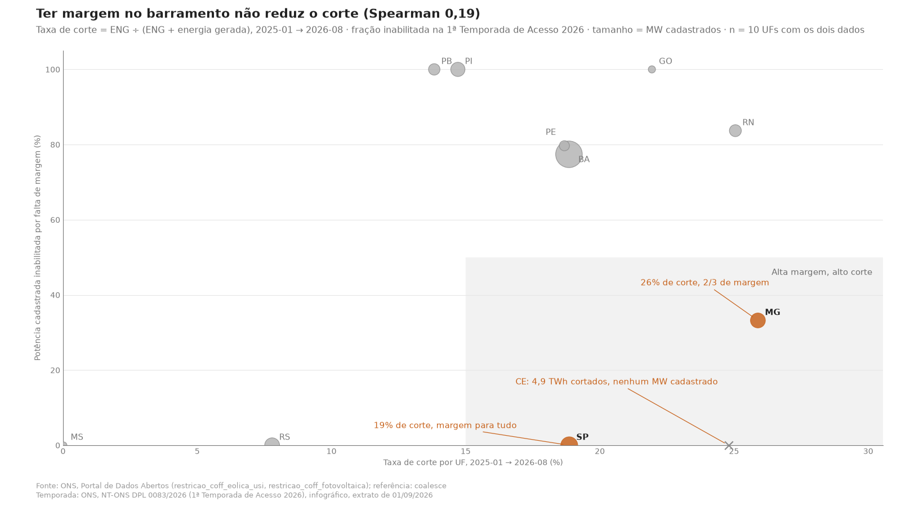
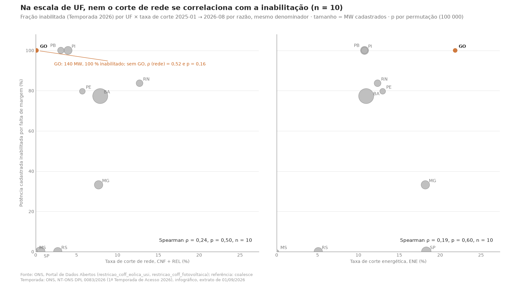

# constrained-off-ons

*A small, reproducible descriptive analysis of curtailment ("constrained-off") of wind and solar plants in Brazil, built only on ONS open data: explicit qualification rules, every discarded record counted, and a sensitivity check on the choice of reference generation.*

Análise descritiva reproduzível do constrained-off (energia não gerada, ENG) de usinas eólicas e fotovoltaicas do SIN, usando exclusivamente os dados abertos do ONS.

## O problema

Constrained-off é o corte de geração eólica e solar determinado pelo ONS por restrições do sistema: energética, de confiabilidade ou elétrica. O ONS publica os registros semi-horários por usina nos dados abertos. O dado bruto só vira informação quando a regra de qualificação é explícita: o que conta como restrição, qual referência define a energia não gerada e o que é descartado. Este repositório fixa essa regra, conta tudo o que exclui e mostra quanto o resultado muda com a escolha da referência.

## Resultados

Janela 2023-01 → 2026-08 (eólica) e 2024-04 → 2026-08 (fotovoltaica), referência efetiva `coalesce(referência final, referência)`.



**Fig. 1** — Na eólica, a energia não gerada foi de 3,2 TWh em 2023 para 25,4 TWh em 2025, e a taxa de corte subiu de 3,3% para 18,6%. Na solar, a taxa de corte passou de 25% em 2025.



**Fig. 2** — A razão energética (controle carga-frequência) responde pela maior parte da energia cortada. Confiabilidade e elétrica pesam menos em energia, mas são as razões ligadas à rede local. São as únicas que a expansão da transmissão resolve.



**Fig. 3** — O corte é concentrado. Um único conjunto fotovoltaico acumula 1,9 TWh de energia não gerada, com taxa de corte de 25,7%. Olhar a taxa, e não só o volume, separa usinas grandes de usinas mal posicionadas.



**Fig. 4** — Desde maio de 2025 o corte se concentra entre 8h e 14h. É o horário em que a geração solar se soma à eólica e a carga do sistema está baixa.



**Fig. 5** — O ONS passou a descrever as restrições em setembro de 2025. Desde então, "Controle de frequência do SIN" responde pela maior parte da energia cortada. As outras descrições citam linhas e fluxos específicos e funcionam como um mapa dos gargalos de transmissão.

Tabelas: [`docs/resumo_anual.csv`](docs/resumo_anual.csv) (ano × fonte: ENG, energia gerada, taxa de corte), [`docs/top_usinas.csv`](docs/top_usinas.csv), [`docs/top_descricoes.csv`](docs/top_descricoes.csv), [`docs/eng_por_subsistema.csv`](docs/eng_por_subsistema.csv), [`docs/sensibilidade_referencia.csv`](docs/sensibilidade_referencia.csv), [`docs/validacao_externa.csv`](docs/validacao_externa.csv).

## Método

1. **Fontes**: pacotes CKAN `restricao_coff_eolica_usi` e `restricao_coff_fotovoltaica` do Portal de Dados Abertos do ONS (agregados por usina/conjunto, semi-horários). Descoberta pela API e download em Parquet com cache local. Dicionário de dados gerado do JSON do portal ([`docs/dicionario.md`](docs/dicionario.md)).
2. **Carga**: validação das 16 colunas, Δt inferido dos dados (30 min), leitura estrita com contagem de linhas malformadas ([`docs/relatorio_carga.md`](docs/relatorio_carga.md)).
3. **Qualificação**: regras R1–R12 explícitas. Restrito = código de razão presente; código ∈ {ENE, CNF, REL, PAR}; chave (`id_ons`, instante). Nada é descartado em silêncio: cada motivo e cada flag é contado ([`docs/metodologia.md`](docs/metodologia.md), [`docs/relatorio_qualificacao.md`](docs/relatorio_qualificacao.md)).
4. **ENG** por registro = max(referência efetiva − geração, 0) × 0,5 h. Energia gerada = geração × 0,5 h. Taxa de corte = ENG ÷ (ENG + energia gerada). Nota de terminologia: **ENG ≡ GNR** (geração não realizada) dos documentos anteriores.
5. **Sensibilidade**: a referência final só existe para REL. Usá-la (coalesce) em vez da referência reduz a ENG elétrica em 21% (eólica) e 14% (FV). ENE e CNF não mudam.
6. **Validação**: a energia não gerada por razão energética em 2024 (4.330 GWh) coincide com o valor publicado pelo ONS no RT DGL-ONS 0189/2025. A série mensal de GNR% (eólica + FV) reproduz a curva apresentada pelo ONS em out/2025 com correlação 0,996 e erro absoluto médio de 0,37 p.p. em 33 meses. A coincidência em ENE é esperada, porque a referência final não afeta essa categoria. Ela valida a ingestão e a qualificação. Não valida a escolha da referência para REL, onde a sensibilidade é de −21% (eólica) e −14% (FV).

## Reproduzir

Requisitos: Python ≥ 3.11 e `git`. Escolha um dos dois caminhos equivalentes para o ambiente:

```bash
# (a) venv padrão da biblioteca do Python
python3 -m venv .venv && source .venv/bin/activate && pip install -e ".[dev]"
```

```bash
# (b) uv (instala o Python 3.12 se necessário)
uv venv --python 3.12 .venv && source .venv/bin/activate && uv pip install -e ".[dev]"
```

Depois, em qualquer dos dois casos:

```bash
python scripts/rodar.py --desde 2023-01      # baixa (~360 MB), qualifica, calcula e gera figuras/CSVs
jupyter notebook notebooks/01_exploracao.ipynb
```

Opções: `--referencia referencia` (sem a referência final), `--excluir-disp-zero`, `--ate AAAA-MM`, `--fontes EOL`, `--forcar` (rebaixa o cache), `--sem-download`. Testes: `pytest`. Lint: `ruff check .`.

## Extra — Temporada de Acesso 2026

Cruzamento geográfico (não causal) entre a energia não gerada por UF em 2025-01 → último mês e o resultado da 1ª Temporada de Acesso 2026 do ONS (NT-ONS DPL 0083/2026, extrato de 01/09/2026). O cadastro classifica a potência em atendimento direto (AD), atendimento condicionado (ADVC), processo competitivo (PC) ou inabilitada por falta de margem (INAB). Método, transcrição e ressalvas em [`docs/metodologia.md`](docs/metodologia.md).



**Fig. 6** — Os dois mapas coincidem em volume. BA, RN, PI, PE e PB concentram a energia não gerada e também a potência inabilitada por falta de margem. A taxa de corte, porém, não acompanha a inabilitação (Spearman 0,19, n = 10). MG corta 26% com dois terços da potência cadastrada com margem. SP corta 19% com margem para todo o cadastro. A inabilitação mede a rede local em regime permanente. O corte que domina é energético e sistêmico, e a margem no barramento não evita esse tipo de corte.



**Fig. 7** — Taxa de corte (2025–2026) e fração inabilitada na Temporada, por UF. A correlação é fraca. O Ceará aparece à parte: 4,9 TWh cortados e nenhum MW cadastrado.

Teste por razão da restrição: a taxa de corte de cada UF foi separada em parcela de rede (CNF + REL) e parcela energética (ENE), com o mesmo denominador, e cada uma foi correlacionada com a fração inabilitada (Spearman, p por permutação; método e tabela em [`docs/metodologia.md`](docs/metodologia.md), dados em [`docs/correlacoes_por_razao.csv`](docs/correlacoes_por_razao.csv)).



**Fig. 8** — Separando a taxa de corte por razão, a correlação com a inabilitação continua fraca: ρ = 0,24 para o corte de rede (CNF + REL) e 0,19 para o energético, ambos com p ≥ 0,5. Sem GO, que tem 140 MW cadastrados e 100% inabilitados, o corte de rede sobe para ρ = 0,52 e o energético vai a zero. É a direção esperada, mas com nove UFs não é conclusivo (p = 0,16). O que os dados mostram sem estatística: onde a Temporada deu margem para todo o cadastro, o corte é quase todo energético (SP: 18,3 de 18,9 pontos; GO: 21,8 de 21,9). Onde não há margem, a parcela de rede é maior (RN: 12,7 de 25,1). UF é uma escala grossa para restrição de rede; o teste adequado é por ponto de conexão, e fica como próximo passo.

## Limitações

Os dados são sujeitos a reconsistência pelo ONS após a publicação. A apuração regulatória (REN ANEEL 1.030/2022) não é reproduzida: não há franquias, nem regras de elegibilidade por usina. Conjuntos (Tipo II-C) não são desagregados por usina. `dsc_restricao` só é preenchida desde set/2025. O código PAR consta do dicionário e não ocorre em nenhum dos 73 meses. Na eólica, usinas entram e saem do dataset ao longo da janela.

## Próximos passos

1. Desagregar conjuntos por usina com os datasets `*_detail` (proporção da geração estimada) e usar a flag de dado inválido.
2. Auditar a coerência da classificação do ONS contra as diretrizes de operação, com reclassificação.
3. Comparar usinas da mesma região ou ponto de conexão.
4. Cruzar com carga, intercâmbios e reanálise meteorológica (ERA5).
5. Valorar a ENG (PLD) e dimensionar armazenamento (BESS).
6. Modelo preditivo de probabilidade de constrained-off por usina e hora.

## Autor

Jamenson Alves Júnior, UFPE. Licença MIT.
